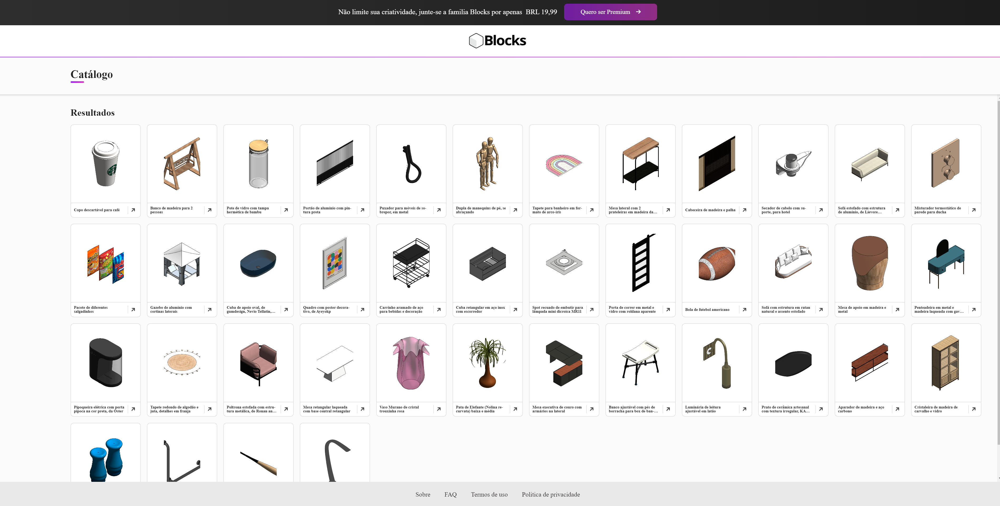

# <div align="center">📋 Blocks APIs Front End Test</div>

<a href="https://blocksrvtfrontendtest.netlify.app/">

                             </a>

## Blocks APIs Front End Test

The project `Blocks APIs Front End Test` is an single-page web application written using React with Typescript that allows user to get the families response from the Blocks APIs.

It is a Front End Coding Challenge for Blocks Developer Position.

## Getting Started

The following is recommended for the development environment:

1. Usage of [Visual Studio Code](https://code.visualstudio.com/) as IDE and the following plugins:

   - Prettier - Code formatter
   - ESLint

2. [Node.js](https://nodejs.org/en/download/)
3. [Yarn](https://yarnpkg.com/)
4. [GIT](https://git-scm.com/)

## 🛠️ Technologies

<ul>
  <li><a href="https://reactjs.org/">React JS</a></li>
  <li><a href="https://nodejs.org/en/">Node.Js</a></li>
  <li><a href="https://www.typescriptlang.org/">Typescript</a></li>
  <li><a href="https://storybook.js.org/">Story Book</a></li>
   <li><a href="https://styled-components.com/">Styled Components</a></li>
  <li><a href="https://emotion.sh/docs/introduction">Emotion</a></li>
  
</ul>

### Folder Structure

`./frontend/`  
├── `.gitignore` -> _ignore settings from git_  
├── `public` -> static and public files  
├── `src` -> react code
└── `theme.ts` -> theme specification for styled-system
└── `README.md` -> _content of this file_

`./frontend/src/`  
├── `assets` -> folder to store static images, such as logos and icons  
├── `clients` ->services for external access   
├── `components` ->reusable React components, separated into subfolders  
└── `context` -> folder to store context methods 
└── `features` -> folder to store each "feature" block   
├── `hooks` -> folder to store custom hooks  
├── `types` -> folder to organize TypeScript types from the project 


## Run

```
$ git clone https://github.com/gapasquantonio/frontend.git
```
### 1. Install yarn

See [how to install yarn](https://classic.yarnpkg.com/lang/en/docs/install/#mac-stable).

### 2. Install dependencies in `package.json`

```zsh
# running `yarn` in your shell will install dependencies
yarn
```
### 3. (Optional) Start storybook

```zsh
yarn storybook
# will start at http://localhost:6006/
```

### 4.  Start development server

Instead of using storybook, you can use the dev server.

```zsh
yarn start
```
The application will open in the browser on http://localhost:3000

## Test

Run this project's tests

```bash
$ yarn test
```


## Commits

This project was build around [Karma pattern](http://karma-runner.github.io/6.3/dev/git-commit-msg.html) into commit messages
